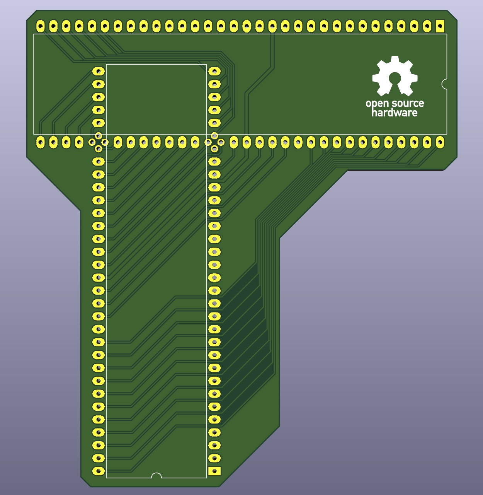
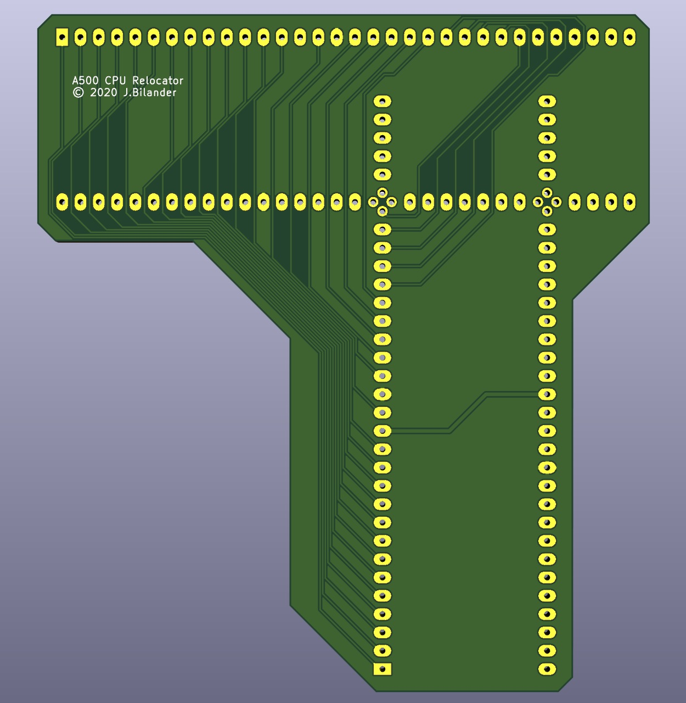

# Amiga_500_cpu_relocator
An Amiga 500 CPU Relocator made with KiCad 5.1.2-1

***

Please Note that I haven't had this PCB made yet by any boardhouse, and I'm not sure I will have the need. I cannot guarantee it will work but I'm pretty sure it will. The accelerator card to be used with this relocator is supposed to be 100 x 100 mm like the TF53X cards and will be relocated to hover over the Denise chip.
